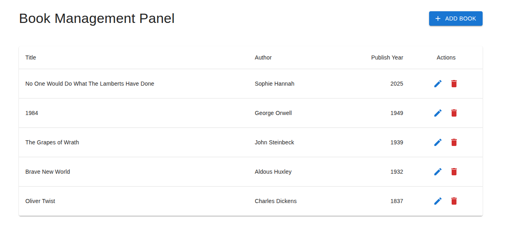
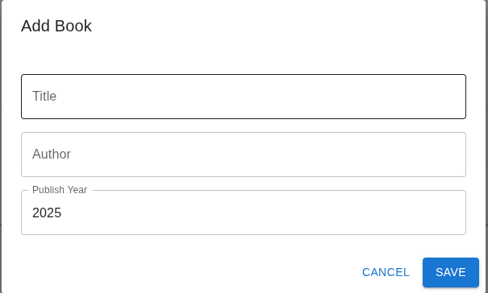
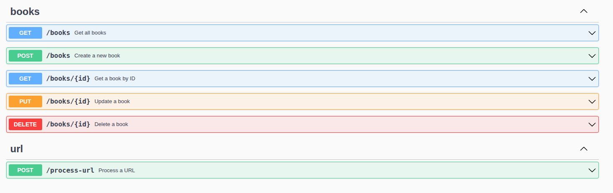

📚 Book Management API & Dashboard

This is a full-stack web application for managing a collection of books.
It features a RESTful API built with Go (Golang) and a dynamic, user-friendly frontend built with Next.js, React, and TypeScript.

✨ Features

🧠 Backend (Go)

    Full CRUD operations for books

    PostgreSQL integration for data persistence

    Swagger documentation with OpenAPI

    Unit tests for API endpoints

    CORS middleware for secure frontend/backend communication

    Dockerized for easy setup and deployment

💻 Frontend (Next.js + React)

    Responsive dashboard to display, add, edit, and delete books

    React Context API for state management

    React Hook Form for client-side validation

    Seamless modal dialogs

    Dynamic routing for book details

    User-friendly error handling and notifications

<table> <tr> <td><strong>Main Dashboard</strong></td> <td><strong>Add/Edit Book Modal</strong></td> </tr> <tr> <td></td> <td></td> </tr> <tr> <td><strong>Swagger API Docs</strong></td> </tr> <tr> <td></td> </tr> </table>

🛠 Tech Stack
| Layer     | Tech                                                 |
| --------- | ---------------------------------------------------- |
| Backend   | Go, Gin, PostgreSQL, pgx, Docker, Swag               |
| Frontend  | React, Next.js, TypeScript, Material UI (MUI), Axios |
| Dev Tools | Git, Docker, Swagger, React Hook Form                |

📦 Backend Setup

# Navigate to the backend directory
cd backend

# Start PostgreSQL with Docker
docker-compose up -d

# Install dependencies
go mod tidy

# Run the server
go run main.go

🌐 Frontend Setup

# Navigate to frontend
cd frontend

# Install dependencies
npm install

# Start development server
npm run dev

📑 API Documentation

Once the backend is running, access Swagger UI at:

    http://localhost:8080/swagger/index.html

You can view and interact with all API endpoints directly.

📬 API Endpoints

| Method | Endpoint      | Description        |
| ------ | ------------- | ------------------ |
| GET    | `/books`      | Retrieve all books |
| POST   | `/books`      | Add a new book     |
| GET    | `/books/{id}` | Get book by ID     |
| PUT    | `/books/{id}` | Update book by ID  |
| DELETE | `/books/{id}` | Delete book by ID  |

